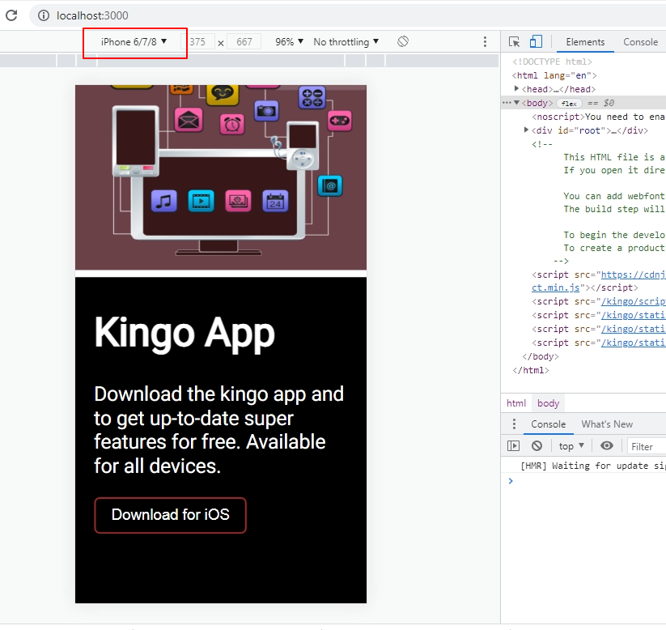
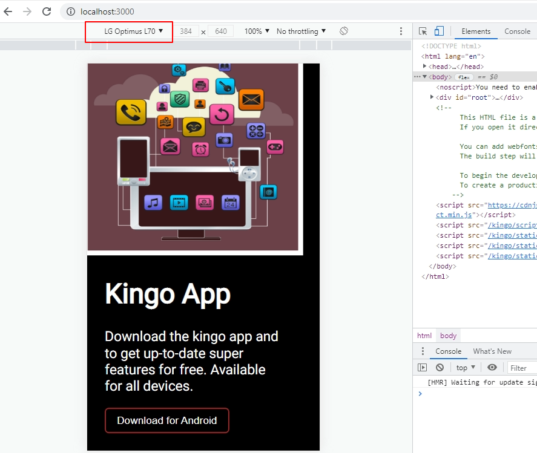
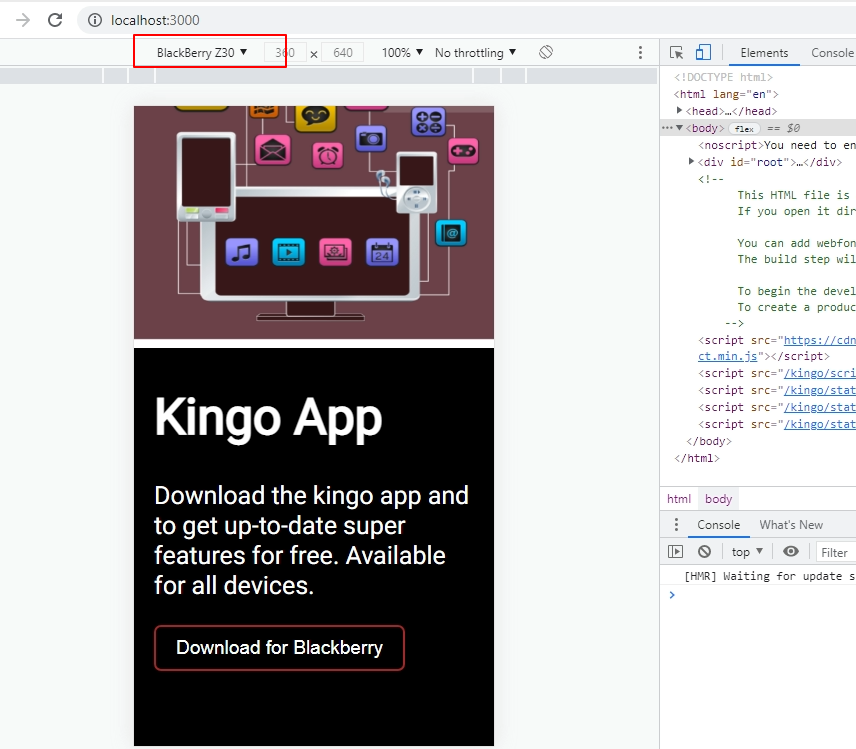

## Detecting The Device Type And Rendering Accordingly in React
Sometimes you might want to check what kind of device a user is viewing a website on. Maybe you want to make the page responsive. Or, as is the case here, you want to render something different.

The download page renders a different text on the button depending on the kind of viewing device. The device detection feature was implemented using the [mobile-detect.js](https://www.npmjs.com/package/mobile-detect) JavaScript library. The library parses the user agent string from the browser and provides us with some API methods for retrieving useful information about the client.

## Screenshots

## Cloning the project
- Using Git, you can clone this project to your local machine with the `git clone` command
- Run `npm install` to install all dependencies

You are free to fork this project for your personal use.

## View Demo
This app is currently live [here](https://kingsleyubah.github.io/hacker-news-clone/)

## Available Scripts

In the project directory, you can run:

### `npm start`

Runs the app in the development mode.\
Open [http://localhost:3000](http://localhost:3000) to view it in the browser.

The page will reload if you make edits.\
You will also see any lint errors in the console.

### `npm run build`

Builds the app for production to the `build` folder.\
It correctly bundles React in production mode and optimizes the build for the best performance.

The build is minified and the filenames include the hashes.\
Your app is ready to be deployed!

See the section about [deployment](https://facebook.github.io/create-react-app/docs/deployment) for more information.

### `npm run eject`

**Note: this is a one-way operation. Once you `eject`, you can’t go back!**

If you aren’t satisfied with the build tool and configuration choices, you can `eject` at any time. This command will remove the single build dependency from your project.

Instead, it will copy all the configuration files and the transitive dependencies (webpack, Babel, ESLint, etc) right into your project so you have full control over them. All of the commands except `eject` will still work, but they will point to the copied scripts so you can tweak them. At this point you’re on your own.

You don’t have to ever use `eject`. The curated feature set is suitable for small and middle deployments, and you shouldn’t feel obligated to use this feature. However we understand that this tool wouldn’t be useful if you couldn’t customize it when you are ready for it.
